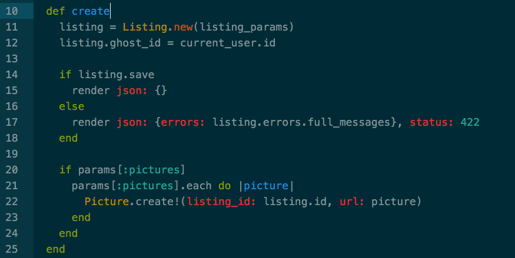
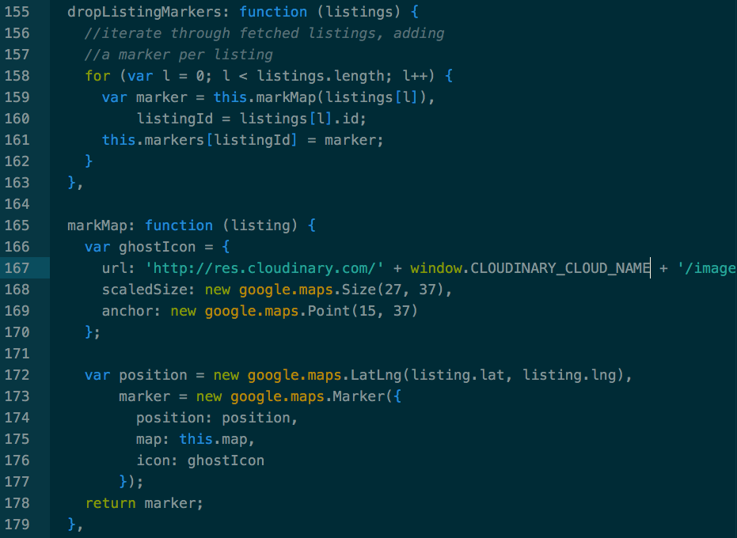
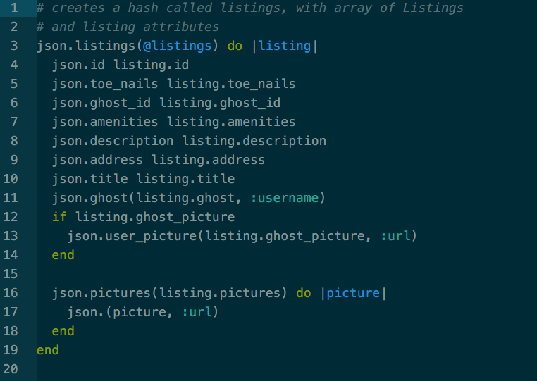
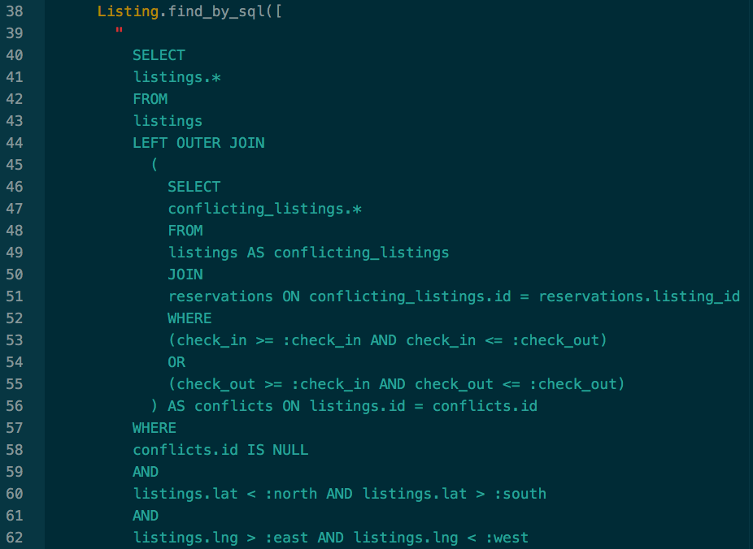

# Scarebnb

[Link to Live App][heroku]

[heroku]: http://www.scarebnb.rocks

## Minimum Viable Product

Scarebnb is a horror movie themed site allowing users to list, find, and rent lodging. It is inspired by Airbnb, built using Ruby on Rails for the backend and React.js for the front end.

## Features

 * Create an account, log in / log out
 * Create and delete listings
 * Search for listings using Google's Autocomplete API
 * Refresh listing results upon scrolling through map, changing check-in dates, or changing location without page refresh
 * Listing icons bounce on map upon scrolling over listing picture

# Code Samples

 * Controllers listing create action

 * Using Google Maps API to mark a map per fetched listing

 * jbuilder view used to reduce AJAX requests to the server.

 * SQL query to efficiently filter listings by their coordinates and availability on given dates.

### To-Do
 * User reviews of listings
 * Carousel for each block in listing index
 * Messaging between Ghost and Guest
 * Visual calendar of availability to listing show
